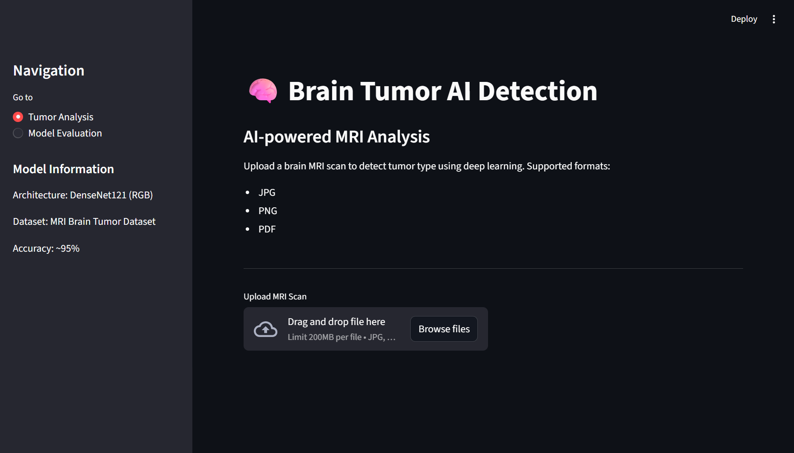
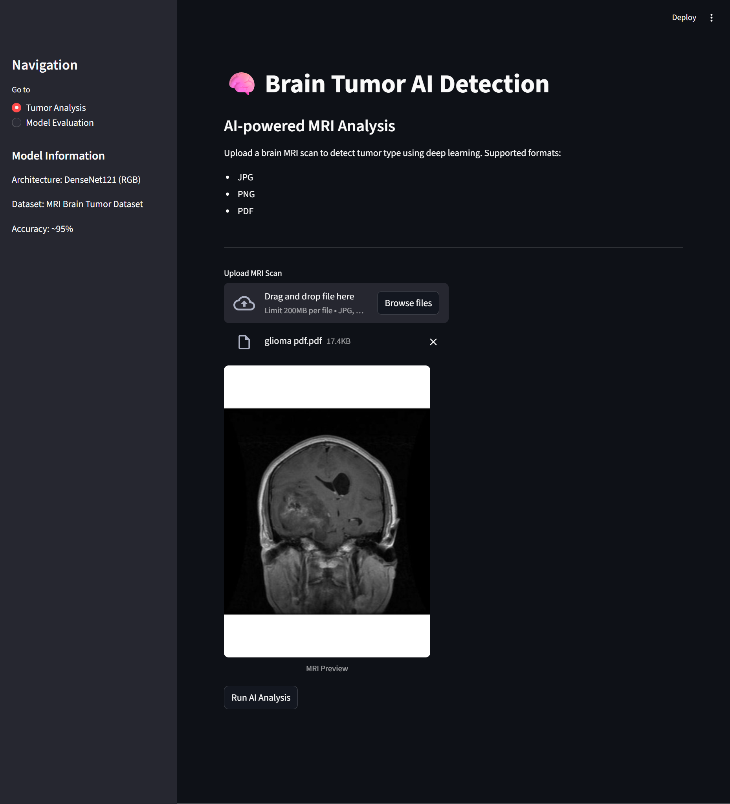
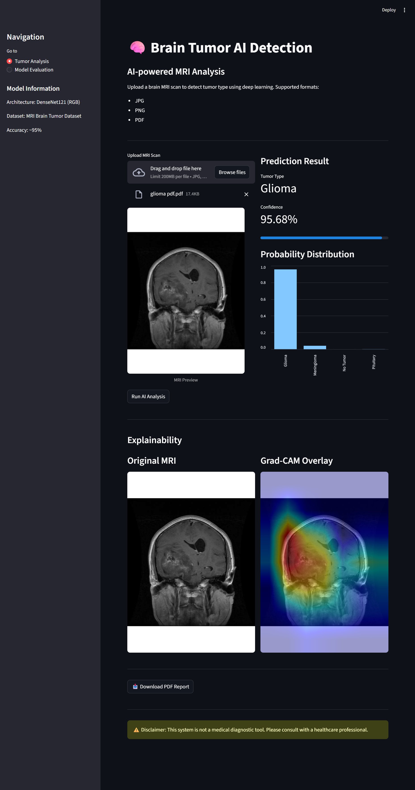
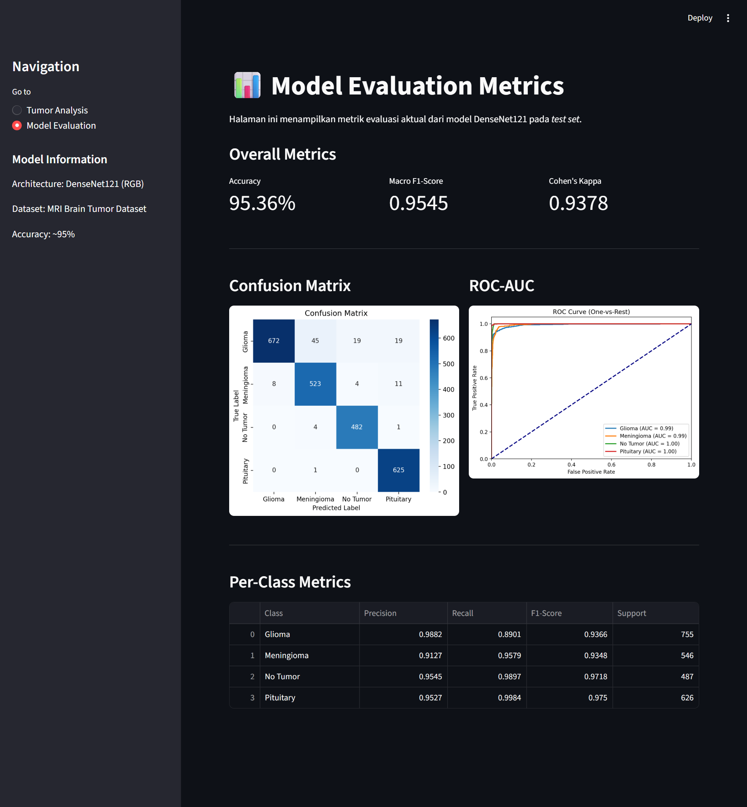

# 🧠 Brain Tumor MRI Classification AI

AI-powered web application for classifying brain tumors from MRI scans using deep learning.

This project uses **transfer learning with DenseNet121** to classify MRI images into four categories:
- Glioma
- Meningioma
- Pituitary Tumor
- No Tumor

The system also provides **Grad-CAM visualization** to highlight the regions of the MRI image that influenced the model's decision.

---

# 🚀 Features

- Upload MRI scans (JPG, PNG, PDF)
- Automatic image preprocessing
- Brain tumor classification using CNN
- Prediction confidence score
- Probability distribution visualization
- Grad-CAM explainability
- Model evaluation dashboard
- Downloadable PDF report

---

# 🧠 Model

**Architecture:** DenseNet121 (Transfer Learning)

**Classes:**
- Glioma
- Meningioma
- Pituitary
- No Tumor

**Evaluation Metrics:**
- Accuracy
- Precision
- Recall
- F1 Score
- ROC-AUC
- Confusion Matrix

---

# 🏗 Project Structure

```markdown
brain-tumor-ai/
│
├── app.py
├── packages.txt
├── requirements.txt
│
├── model/
│ ├── densenet_evaluation_results.csv
│ └── best_model_densenet.keras
│
├── utils/
│ ├── preprocessing.py
│ ├── inference.py
│ ├── gradcam.py
│ ├── report.py
│ └── pdf_handler.py
│
├── components/
│ ├── uploader.py
│ ├── result_panel.py
│ ├── evaluation.py
│ └── chart.py
│
├── images/
│ ├── UI_01.png
│ ├── UI_02.png
│ ├── UI_03.png
│ └── UI_04.png
│
└── README.md
```

---

# 🔄 Inference Pipeline

```markdown
MRI Upload
    ↓
Image Preprocessing
    ↓
DenseNet121 Model
    ↓
Softmax Prediction
    ↓
Grad-CAM Visualization
    ↓
Result Display
```

---

# ⚙️ Installation

Clone the repository:
```bash
git clone https://github.com/Dhizolimi/brain-tumor-mri-classification.git
cd brain-tumor-mri-classification
```
Install dependencies:
```bash
pip install -r requirements.txt
```

---

# 🚀 Run App

```markdown
streamlit run app.py
```
The application will run at:
```markdown
http://localhost:8501
```

---

# 🖥 Application Interface

The web application provides:
- MRI upload interface
- AI prediction results
- Probability distribution chart
- Grad-CAM visualization
- Model evaluation dashboard

---

# 📊 Model Evaluation

Model performance is evaluated using:
- Confusion Matrix
- ROC Curve
- Per-class Precision, Recall, F1 Score
- Accuracy

---

# 🖼 Application Preview

## Main Interface




## Model Evaluation


---

# ⚠ Disclaimer

This application is intended for research and educational purposes only. It is not a medical diagnostic tool and should not be used as a substitute for professional medical advice.

---

# 📚 Tech Stack

- Python
- TensorFlow/Keras
- Streamlit
- OpenCV
- NumPy
- Matplotlib
- Scikit-learn

---

# 👨‍💻 Author

- [Abu Bakar Akhmad](https://github.com/Dhizolimi)

---

# 📝 License cc by 4.0

This project is licensed under the CC BY 4.0 License

---

# 🙏 Acknowledgments

```markdown
- [Brain Tumor MRI Dataset](https://data.mendeley.com/datasets/zwr4ntf94j/5)
- [TensorFlow/Keras Documentation](https://www.tensorflow.org/api_docs/python/tf/keras)
- [Streamlit Documentation](https://docs.streamlit.io/)